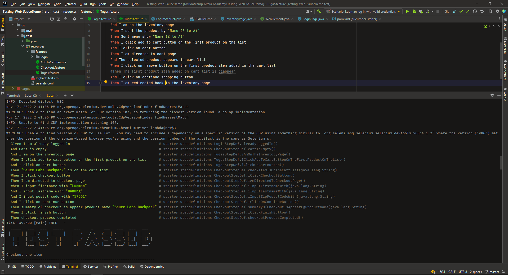
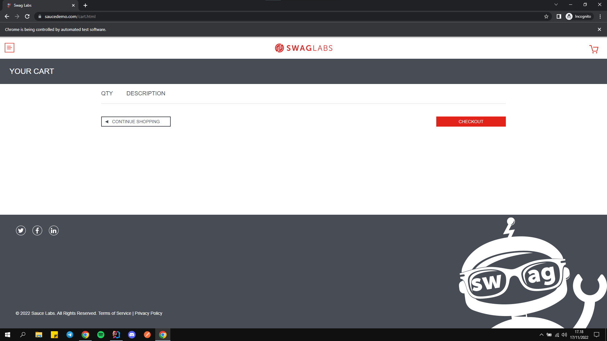

<div align="center">
  <a href="https://github.com/ALTA-Bringeee-Group1/Bringeee-API">
    <br />
  </a>
  WEB Automation Testing Project
    <br />
</div>

## 📑 About the Project

<p align="justify">Automation Testing on Sauce Labs app. Sauce Labs is an American cloud-hosted, web and mobile application automated testing platform company based in San Francisco, California.</p>

## 📓 Testing Documentation
[Test Case API]()

## 📝 Reports

#### Summary Report


#### Coverage Report


#### Automation Testing When Run in Intellij IDE and chrome



## 🛠 Tools

**Automation:**  


**Framework for automation:**


## 🏎️ How to Run all Test Scenarios

1. Clone the repository
```bash
  $ git clone https://github.com/Luqmanhanung/Testing-Web-SauceDemo.git
```
2. Open  this Project Repository on Intellij IDE and Run this on the IDE terminal

```bash
  $ mvn clean verify
```


## 📱 Created By

[](https://www.linkedin.com/in/luqman-hanung-asidiq/)
[](https://github.com/Luqmanhanung/)

<h5>
<p align="center">:copyright: 2022 | This Repository Built with :heart: from <a href="https://www.linkedin.com/in/luqman-hanung-asidiq/">Luqmanhanung</a> </p>
</h5>

